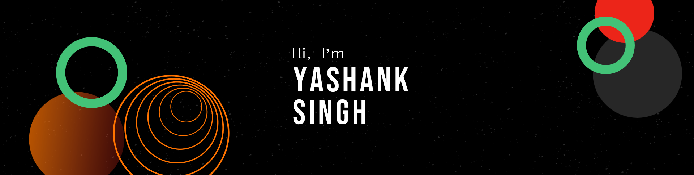

<!--# Hello there 👋-->

<h3>I am a Computer Science student from India.</h3>

* 🌱 Always learning something new
* ❤️ Love all things tech
* 😄 Pronouns: He/Him
* ⚡ I love playing and making games!

<!--
**yashanksingh/yashanksingh** is a ✨ _special_ ✨ repository because its `README.md` (this file) appears on your GitHub profile.

Here are some ideas to get you started:

- 🔭 I’m currently working on ...
- 🌱 I’m currently learning ...
- 👯 I’m looking to collaborate on ...
- 🤔 I’m looking for help with ...
- 💬 Ask me about ...
- 📫 How to reach me: ...
- 😄 Pronouns: ...
- ⚡ Fun fact: ...
-->

<h2>Github Stats</h2>

  
  
  
  
  
  
  

